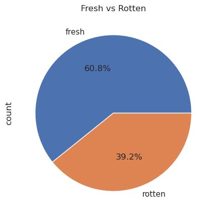
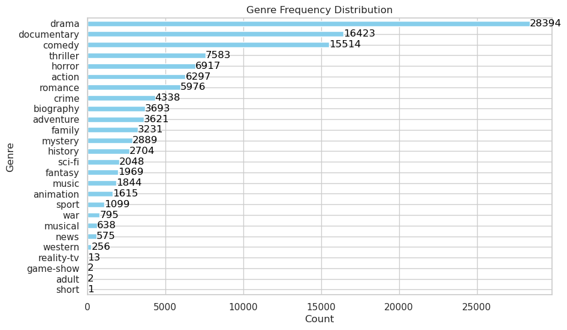
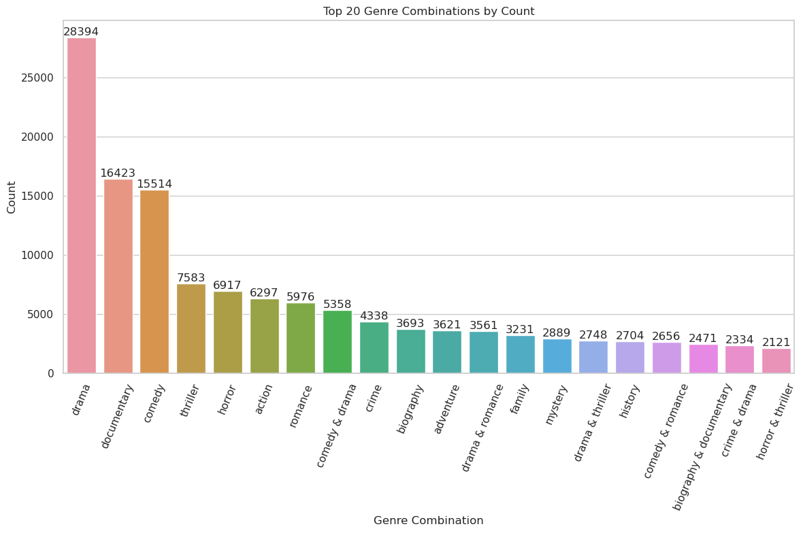
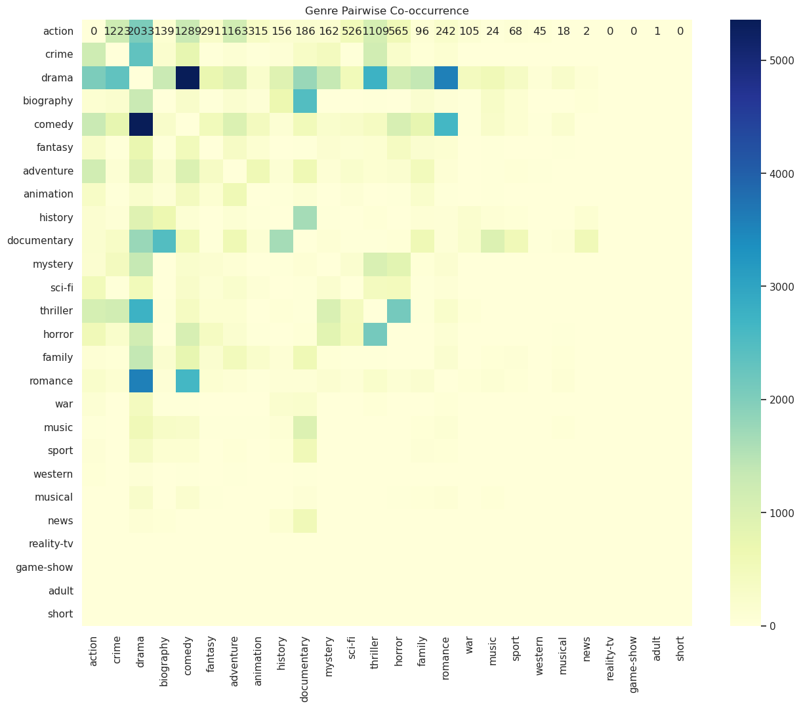
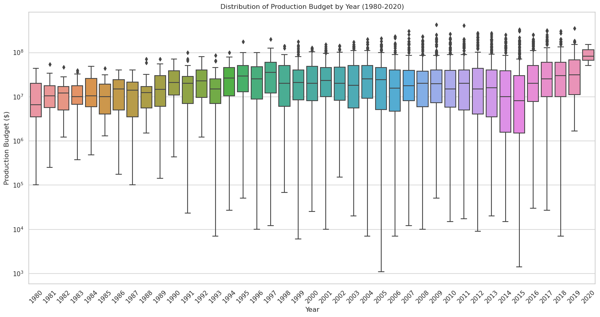
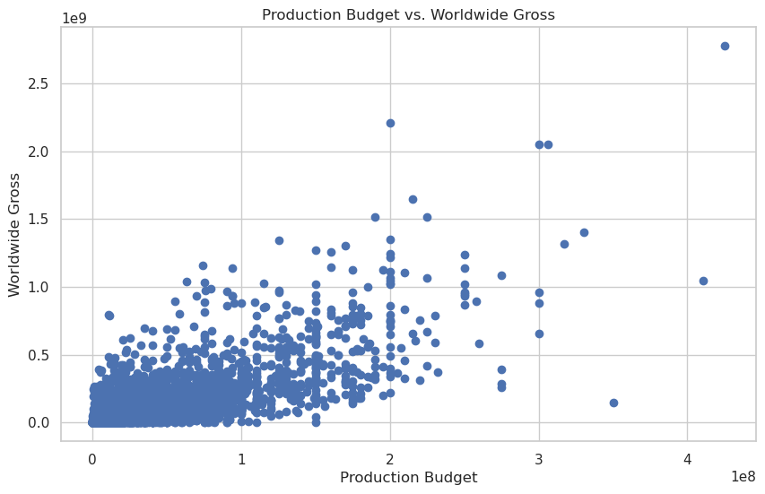
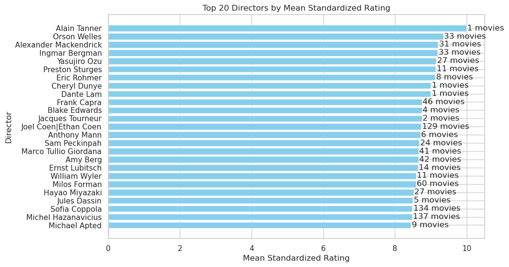
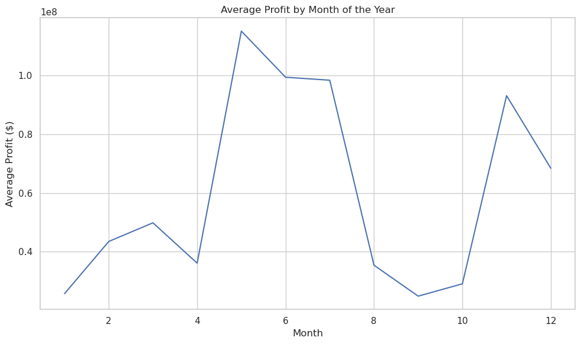

# MOVIE STUDIO ANALYSIS

View an interactive dashboard for this project [here](https://public.tableau.com/views/movie-studio-project/Dashboard?:language=en-US&:sid=&:redirect=auth&:display_count=n&:origin=viz_share_link) and presentation slides [here](https://www.canva.com/design/DAGL7nVZQTU/NCAvE62-0TRUyK-suWb59w/edit?utm_content=DAGL7nVZQTU&utm_campaign=designshare&utm_medium=link2&utm_source=sharebutton)

## Business Understanding

In this project, we are tackling a critical business challenge for my company as we venture into the competitive world of original video content creation. Recognizing the trend of major companies producing their own content, our leadership has decided to establish a new movie studio. However, we face a significant knowledge gap in the film industry.

Our role is to conduct a comprehensive analysis of the current box office landscape to identify which types of films are performing best. This research is crucial as it will form the foundation of our studio's content strategy. We are tasked with analyzing data and translating our findings into actionable insights.

### Objective

The ultimate goal of this project is to provide our newly appointed head of the movie studio with data-driven recommendations. These insights will be instrumental in guiding decisions about which types of films to produce, helping us to strategically position our new studio in the market and maximize our chances of box office success.

### Data Understanding

The dataset comprises multiple sources offering insights into movies. The `rt.reviews.tsv` dataset captures movie reviews, including reviewer comments, ratings, review nature, critic details, and publication date. The `rt.movie_info.tsv` dataset provides detailed movie information, such as synopsis, rating, genre, director, release dates, and box office revenues. The `tn.movie_budgets.csv` and `im.db` datasets offer financial insights, including production costs and revenue, and structured movie attributes and ratings. These datasets enable a comprehensive analysis of movie performance, financial success, and audience reception.

* ## This pie chart shows the percentage distribution of critic reviews (Fresh vs. Rotten)

* ## This bar chart shows the distribution of movie genres.

* ## This bar chart shows the genre combinations by count. 

* ## This heatmap shows the genre pairwise co-occurence.

* ## This box plot shows the distribution of production budget by year(1980-2020)

* ## This scatter plot shows the correlation between production budget and worldwide gross.

* ## This bar chart shows the top 20 directors by the mean standardized rating and the number of movies directed. 

* ## This line chart shows the average profit by month of the year. 
